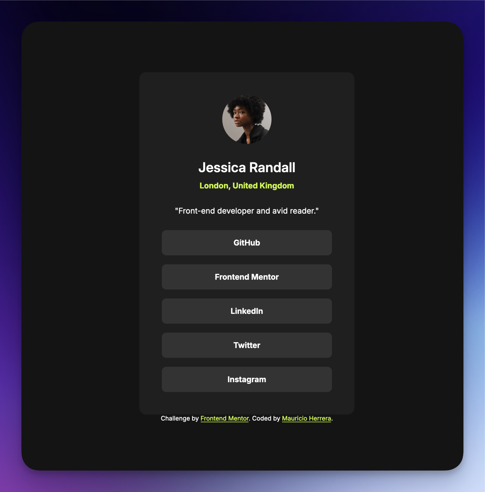

# Frontend Mentor - Social links profile solution

This is a solution to the [Social links profile challenge on Frontend Mentor](https://www.frontendmentor.io/challenges/social-links-profile-UG32l9m6dQ). Frontend Mentor challenges help you improve your coding skills by building realistic projects. 

## Table of contents

- [Overview](#overview)
  - [The challenge](#the-challenge)
  - [Screenshot](#screenshot)
- [My process](#my-process)
  - [What I learned](#what-i-learned)
- [Author](#author)

## Overview

### The challenge

Users should be able to:

- See hover and focus states for all interactive elements on the page

### Screenshot

### Links

- Solution URL: [Add solution URL here](https://your-solution-url.com)
- Live Site URL: [Add live site URL here](https://your-live-site-url.com)

## My process

### What I learned

- when you add too many divs the idea that margins collapse doesn't really work the same way because now the margin is not just between the visible elements but between the elements and the divs that contain them so I need to be more careful when adding divs and also more strategic
- figma on hover animation is very fast, not sure that's intended to be implemented that way, if you don't add an attribution for how fast the transition should be on either transformation, the system seems to apply the same time to both transitions. Figma's slow transition seems to be immediate on hover, and then slow after the hover

## Author

- Website - [Mauricio Herrera](https://www.herrera.wiki)
- Frontend Mentor - [@newspaceracer](https://www.frontendmentor.io/profile/newspaceracer)
- LinkedIn - [@yourusername](https://www.linkedin.com/in/mauricio-herrer4)

